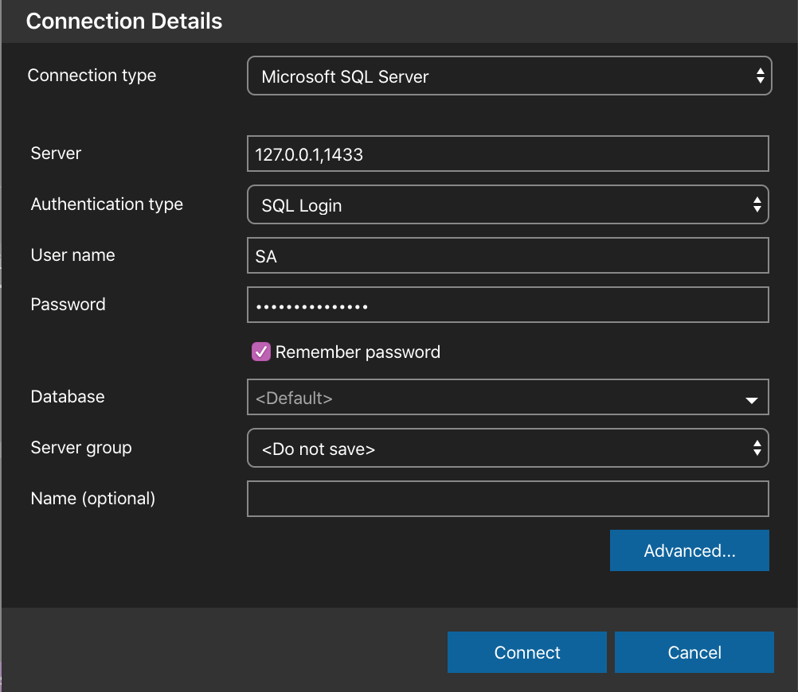

# Welcome to IdentityServer4 (ASP.NET Core 3.x)

## Build application

``` sh
dotnet restore
dotnet build
```

## Configuration

### Apply database

> https://docs.microsoft.com/en-us/sql/linux/quickstart-install-connect-docker?view=sql-server-ver15&pivots=cs1-bash

Download docker image for sql server
> mcr.microsoft.com/mssql/server:2017-latest

**Run**

``` sh
sudo docker run -e "ACCEPT_EULA=Y" -e "SA_PASSWORD=<YourStrong@Passw0rd>" \
   -p 1433:1433 --name sql1 \
   -d mcr.microsoft.com/mssql/server:2017-latest
```

> Update connectionString into `appsetting.json`



**For update exist image**

``` sh
docker pull mcr.microsoft.com/mssql/server:2017-latest
```

Install dotnet ef

``` sh
dotnet tool install --global dotnet-ef
```

Execute database

``` sh
# ApplicationDbContext
# PersistedGrantDbContext
# ConfigurationDbContext
dotnet ef database udpate -c <Context>
```

### Apply sendGrid email

- Register new account in sendGrid
- Create new Api Key
- Update into `appsetting.json`


## Run Application

``` sh
dotnet run
```
